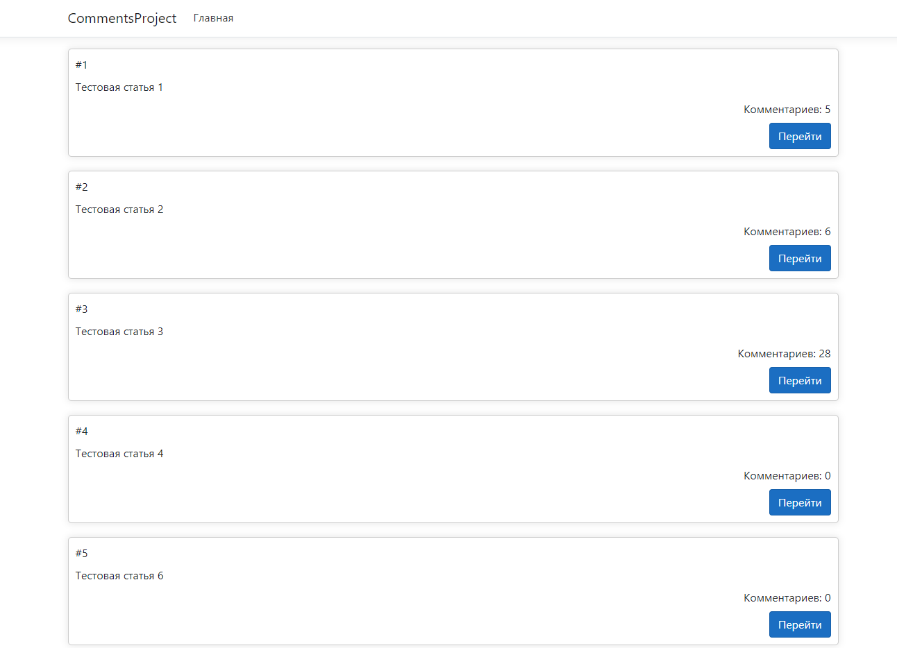
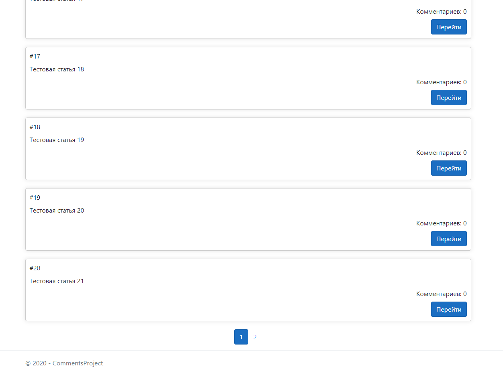
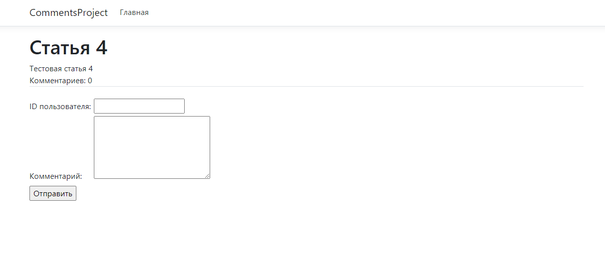
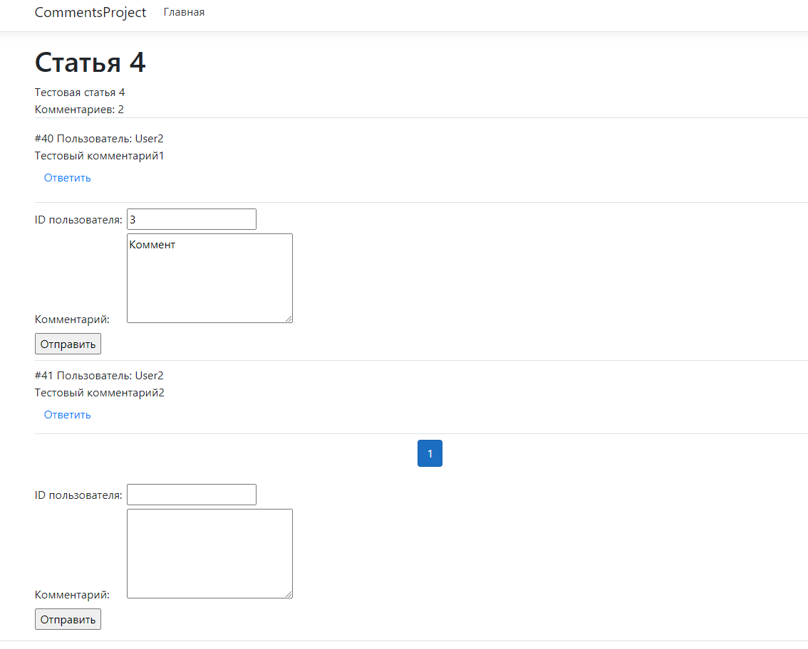
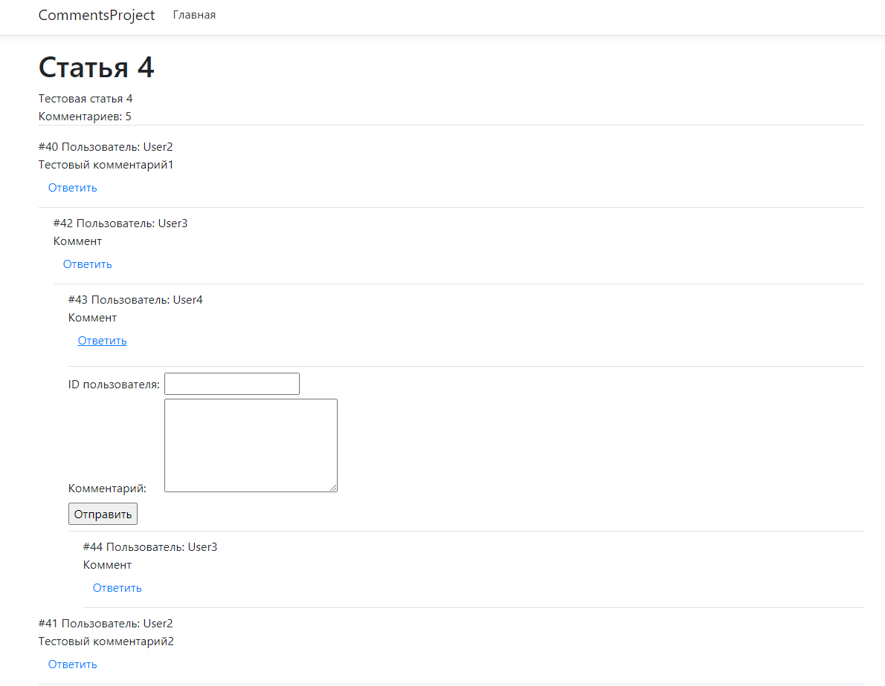
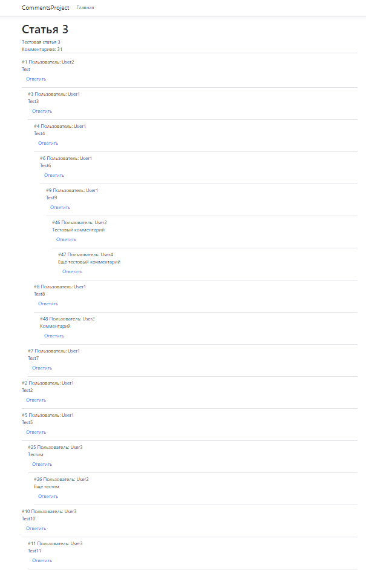
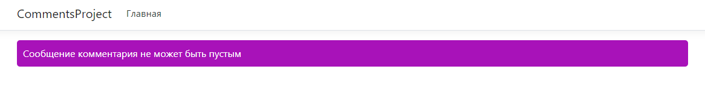
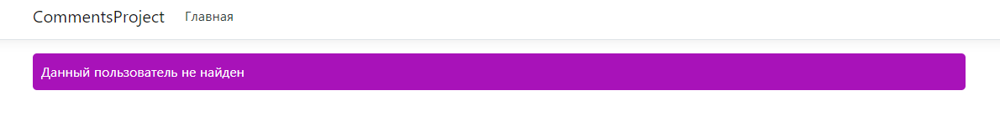

Главная страница:

Главная страница с пагинацией:

Страница статьи:

Добавление комментария второго уровня:

Древовидное добавление комментариев:

Древо комментариев:

Ошибка, если отправлено пустое сообщение:

Ошибка, если пользователь с указанным ID не существует:

